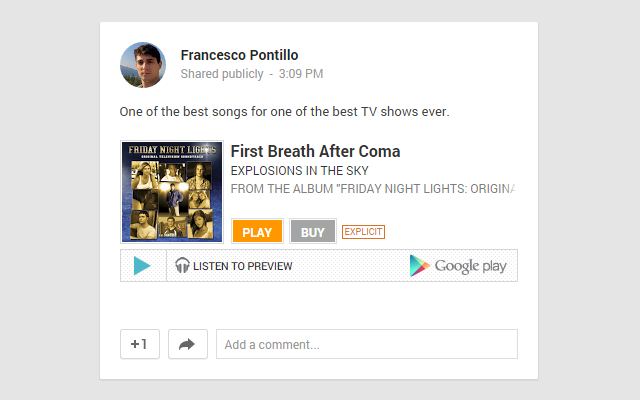

 chrome-gplus-all-access
========================

Chrome extension to add a "Play" button to the Google Plus Play Music sharing box that redirects you to the Play Music All Access album page.

[](https://chrome.google.com/webstore/detail/gplus-all-access/aojkabccmnhckenppejfpgbfbmegplnp)




##Development

You need to have NodeJS with `grunt-cli` and `bower` installed.

```shell
$ npm install -g grunt-cli bower
$ npm install
$ bower install
```

To debug the application with a live reload mechanism, run:

```shell
$ grunt debug
```

Then add the `app` folder as an unpackaged extension in Chrome. That's all.

##Credits

This extension uses the following libraries and resources:

* [jquery](http://jquery.com/)
* [Play icon](http://thenounproject.com/term/play/50657/) by Christopher Holm-Hansen from The Noun Project

##License

```
   Copyright 2014 Francesco Pontillo and Sebastiano Poggi

   Licensed under the Apache License, Version 2.0 (the "License");
   you may not use this file except in compliance with the License.
   You may obtain a copy of the License at

     http://www.apache.org/licenses/LICENSE-2.0

   Unless required by applicable law or agreed to in writing, software
   distributed under the License is distributed on an "AS IS" BASIS,
   WITHOUT WARRANTIES OR CONDITIONS OF ANY KIND, either express or implied.
   See the License for the specific language governing permissions and
   limitations under the License.

```
